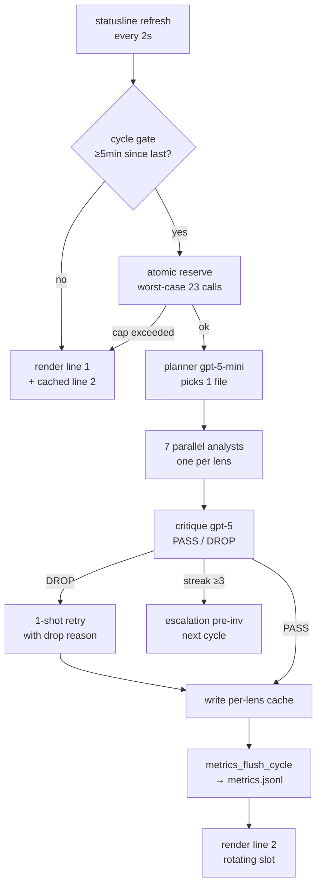
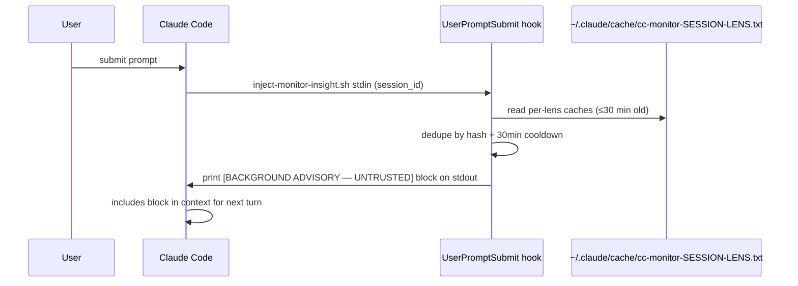

# Pair Polymath — Architecture

## The cycle in one diagram



## Sequence: prompt submit → injection



## Module map

```
bin/
  statusline.sh        # orchestrator: cycle gate, parallel analysts, render
  install.sh           # detect deps, settings.json merge, smoke
  uninstall.sh         # basename-match cleanup
  polymath             # CLI: status / doctor / enable / disable / logs / update / cost / version

lib/
  config.sh            # sources default.env then user.env
  budget.sh            # single shared mkdir-lock, worst-case 23 reservation
  grounding.sh         # pp_contain_path + secret-file/dir denylist
  lens-loader.sh       # parses lenses/*.json with user override
  prompt-loader.sh     # single-pass ${var} substitution (secret-leak guard)
  metrics.sh           # USD rollup → metrics.jsonl (v0.2)
  doctor.sh            # 12 health checks
  audit-log.sh         # installer JSONL audit (planned for P2.3)

hooks/
  inject-monitor-insight.sh   # UserPromptSubmit: dedupe + emit [BACKGROUND ADVISORY] block
  cache-test-result.sh         # PostToolUse: capture test output for grounding

lenses/
  01-ux-design.json … 07-cognitive-flow.json   # built-in registry

prompts/
  planner.md, analyst-primary.md, analyst-retry.md,
  critique.md, escalation-investigation.md, tip-digest.md
```

## State files (under `~/.claude/`)

| Path | Owner | Purpose |
|---|---|---|
| `settings.json` | Claude Code | statusLine + 2 hooks merged in by `install.sh` |
| `cache/pp-budget-YYYYMMDD.txt` | budget.sh | daily call counter |
| `cache/pp-budget-YYYYMMDD.txt.lock` | budget.sh | mkdir-style atomic lock |
| `cache/cc-monitor-SESSION-LENS.txt` | statusline.sh | per-lens observation |
| `cache/cc-monitor-SESSION-LENS-verdict.txt` | statusline.sh | critique PASS/DROP sidecar |
| `cache/cc-monitor-SESSION-LENS-streak.txt` | statusline.sh | drop-streak counter for escalation |
| `cache/metrics.jsonl` | metrics.sh | one line per completed cycle |
| `pair-polymath/lenses/` | user | drop-in JSON overrides |
| `pair-polymath/prompts/` | user | drop-in prompt overrides |
| `pair-polymath/config/user.env` | user | override defaults |

## Invariants

1. **Single source of truth for daily budget.** `pp-budget-YYYYMMDD.txt` is mutated only under `${file}.lock` (`mkdir`-based atomic lock). All callers use `budget_inc` / `budget_reserve`.
2. **Cache files are id-keyed**, not numeric-index-keyed. Reordering / disabling lenses cannot serve stale observations under a wrong identity.
3. **Containment**: `pp_contain_path` realpath-prefix-matches the candidate against cwd. Secret-file / secret-dir denylists reject `.env`, `*.key`, `.ssh/*` etc. even when inside cwd.
4. **Prompt rendering is single-pass** over placeholders in the ORIGINAL template. A substitution value containing `${X}` is NEVER re-scanned.
5. **Atomic settings.json mutations** via `mktemp "${SETTINGS_FILE}.XXXXXX"` (same-FS) + `mv`.
