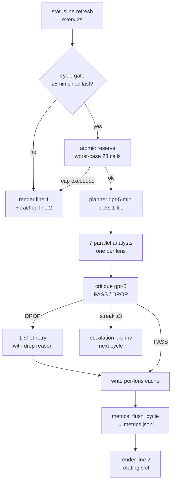
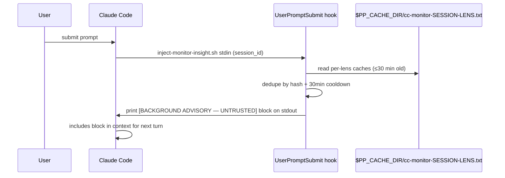

# Pair Polymath — Architecture

## The cycle in one diagram



## Sequence: prompt submit → injection



## Module map

```
bin/
  statusline.sh        # orchestrator: cycle gate, parallel analysts, render
  install.sh           # detect deps, settings.json merge, smoke
  uninstall.sh         # basename-match cleanup
  polymath             # CLI: status / doctor / enable / disable / logs / update / cost / version

lib/
  config.sh            # sources default.env then user.env
  budget.sh            # single shared mkdir-lock, worst-case 23 reservation
  grounding.sh         # pp_contain_path + secret-file/dir denylist
  lens-loader.sh       # parses lenses/*.json with user override
  prompt-loader.sh     # single-pass ${var} substitution (secret-leak guard)
  metrics.sh           # USD rollup → metrics.jsonl (v0.2)
  doctor.sh            # 22 health checks
  audit-log.sh         # installer JSONL audit (v0.2)

lib/memory/             # v0.3 Phase 2.3 — off-by-default memory subsystem
  schema.sh            # per-machine salted hash + SQLite WAL DDL + migration stub
  lock.sh              # mkdir-based pp_memory_with_lock (subshell-isolated trap scope)
  redact.sh            # secret-pattern redaction + path-shape containment
  store.sh             # observation insert + FTS5 hybrid top-K retrieval
  activation.sh        # ln(use+1) - k·days + 0.6·act + 0.4·retention scoring
  signals.sh           # 4 windowed signal taggers (retention/file-edit/commit-mention/test-flip)
  patterns.sh          # LLM-extracted emergent themes → patterns.jsonl
  evict.sh             # LRU-by-activation eviction with summary preservation

hooks/
  inject-monitor-insight.sh   # UserPromptSubmit: dedupe + emit [BACKGROUND ADVISORY] block
  cache-test-result.sh         # PostToolUse: capture test output for grounding

lenses/
  01-ux-design.json … 07-cognitive-flow.json   # built-in registry

prompts/
  planner.md, analyst-primary.md, analyst-retry.md,
  critique.md, escalation-investigation.md, tip-digest.md
```

## State files (under `~/.claude/`)

| Path | Owner | Purpose |
|---|---|---|
| `settings.json` | Claude Code | statusLine + 3 hooks merged in by `install.sh` |
| `cache/pp-budget-YYYYMMDD.txt` | budget.sh | daily call counter |
| `cache/pp-budget.lock` | budget.sh | mkdir-style atomic lock |
| `cache/cc-monitor-SESSION-LENS.txt` | statusline.sh | per-lens observation |
| `cache/cc-monitor-SESSION-LENS-verdict.txt` | statusline.sh | critique PASS/DROP sidecar |
| `cache/cc-monitor-SESSION-LENS-streak.txt` | statusline.sh | drop-streak counter for escalation |
| `cache/metrics.jsonl` | metrics.sh | one line per completed cycle |
| `pair-polymath/lenses/` | user | drop-in JSON overrides |
| `pair-polymath/prompts/` | user | drop-in prompt overrides |
| `pair-polymath/config/user.env` | user | override defaults |
| `pair-polymath/memory/.salt` | schema.sh | per-machine salt, 0600 (v0.3) |
| `pair-polymath/memory/projects/<hash>/observations.sqlite` | store.sh | WAL DB, 0600 in 0700 dir (v0.3) |
| `pair-polymath/memory/projects/<hash>/patterns.jsonl` | patterns.sh / evict.sh | append-only emergent patterns (v0.3) |
| `pair-polymath/memory/projects/<hash>/maintenance-counter` | lock.sh | plain-file maintenance-cycle counter (v0.3) |

## Invariants

1. **Single source of truth for daily budget.** `pp-budget-YYYYMMDD.txt` is mutated only under `pp-budget.lock` (`mkdir`-based atomic lock). All callers use `budget_inc` / `budget_reserve`.
2. **Cache files are id-keyed**, not numeric-index-keyed. Reordering / disabling lenses cannot serve stale observations under a wrong identity.
3. **Containment**: `pp_contain_path` realpath-prefix-matches the candidate against cwd. Secret-file / secret-dir denylists reject `.env`, `*.key`, `.ssh/*` etc. even when inside cwd.
4. **Prompt rendering is single-pass** over placeholders in the ORIGINAL template. A substitution value containing `${X}` is NEVER re-scanned.
5. **Atomic settings.json mutations** via `mktemp "${SETTINGS_FILE}.XXXXXX"` (same-FS) + `mv`.
6. **Memory mutations under `pp_memory_with_lock` only** (v0.3) — any multi-statement read-modify-write against SQLite (signals tagging, activation recompute, eviction, pattern extraction) wraps the inner function call in a `(…)` subshell with `mkdir`-lock around it. Single-statement inserts via SQLite transaction are fine without the wrapper.
7. **Memory bodies redacted at both store time AND inject time** (v0.3) — `pp_memory_redact_body` runs in `pp_memory_insert` and again in `bin/statusline.sh` MEMORY_BLOCK assembly, so observations stored before a redaction-pattern upgrade still get the new pattern applied on next inject.
8. **Off-mode is byte-identical to pre-2.3** (v0.3) — when `PP_MEMORY_ENABLE=0`, the F3 sentinel-strip in `lib/prompt-loader.sh` removes the entire `MEMORY_BLOCK` region (sentinels + content + trailing newline) so the rendered analyst prompt matches the pre-2.3 byte fixture in `test/fixtures/prompts/pre-2.3-analyst-baseline.txt`.

## See also

- `docs/memory-architecture.md` — full memory subsystem reference (v0.3 Phase 2.3)
- `docs/customization.md` — `PP_*` env reference, including 14 `PP_MEMORY_*` knobs
- `docs/cost-model.md` — formula behind `polymath cost`
- `docs/troubleshooting.md` — failure modes by doctor check
- `docs/security.md` — operational threat model
